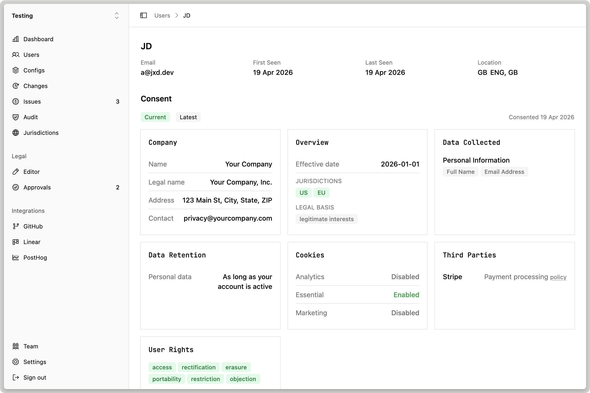

Consent is easy to ship and hard to prove. You need a record of _who_ agreed to _which version_ of your policy, _when_, and from _where_ — and you need it to hold up months later when a user, auditor, or regulator asks what they signed up for.

Today we're shipping the **OpenPolicy Better Auth plugin** to make that record automatic.



## Drop it in

Install the plugin and add it alongside your other Better Auth plugins:

```sh
bun add @openpolicy/better-auth
```

```ts
import { betterAuth } from "better-auth";
import { openpolicy } from "@openpolicy/better-auth";
import config from "./openpolicy";

export const auth = betterAuth({
	plugins: [
		openpolicy({
			config,
			apiKey: env.OPENPOLICY_API_KEY,
		}),
	],
});
```

That's it. Every signup and policy-relevant event now flows into OpenPolicy+ with:

- The exact policy version the user accepted, hashed from your `defineConfig`
- Timestamp, IP, and user agent
- A stable audit log you can export for legal, a DPA, or a regulator

## Why the same config matters

The `config` you pass to the plugin is the same object that `@openpolicy/vite` and `@openpolicy/cli` use to render your privacy and cookie policies. That means the policy your users _see_ and the policy they're recorded as _accepting_ can't drift apart — they're generated from a single source of truth, version by version.

When you update `openpolicy.ts`, the hash changes. OpenPolicy+ sees a new version, and every subsequent acceptance is pinned to it. Previous consent records stay attached to the version they were actually shown.

## What's next

Better Auth is the first of several auth integrations. If you use Clerk, Auth.js, or Lucia and want this pattern next, [open an issue on GitHub](https://github.com/jamiedavenport/openpolicy/issues).

Full docs at [docs.openpolicy.sh](https://docs.openpolicy.sh). If you're integrating OpenPolicy+ and want a hand, [book a demo call](https://cal.eu/jamie-openpolicy/openpolicy-chat-demo).
