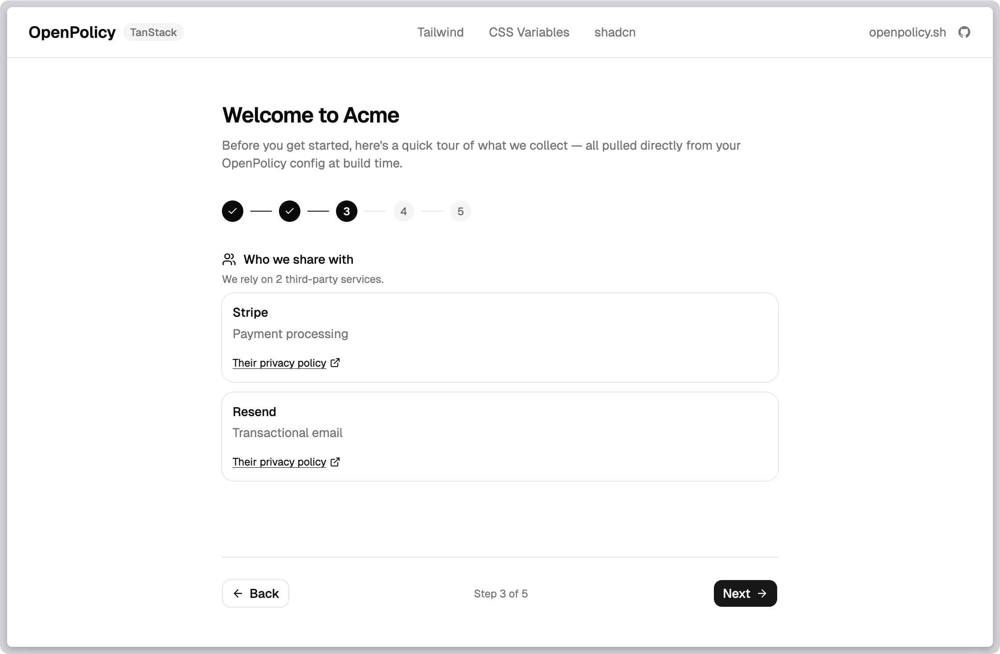

Most teams adopt OpenPolicy for two things: a privacy policy page that doesn't go stale, and a cookie banner that doesn't ship as a third-party script. Both are good reasons. Neither is the whole story.

The privacy page and the cookie banner are the two surfaces users see _when they go looking_. Most users don't. What they do encounter — the signup form, the settings panel, a new feature rolling out — is where trust is actually built or lost. And that's the surface our primitives were always meant to cover.

## The config is a data source

When you write `defineConfig({ ... })`, you're not producing a document. You're producing a typed object that happens to be rich enough to render a legal page — and flexible enough to power anything else you want to build around it.

```ts
import openpolicy from "@/lib/openpolicy";

const { dataCollected, thirdParties, cookies } = openpolicy;
```

Those three fields are the same ones that feed `<PrivacyPolicy />`. They're also already populated by auto-collect: every `collecting()` call in your codebase contributes to `dataCollected`, every `thirdParty()` call (or matched `package.json` entry) contributes to `thirdParties`, and every `<ConsentGate>` or `useCookies().has()` lookup contributes to `cookies`.

That means any UI you build on top of them inherits the same guarantee: change your product, and the UI updates on the next build. No second source of truth, no separate content CMS, no drift.

## What "trust flows" actually look like

Here are four patterns teams are building on top of the same primitives. None of them are shipped components — they're things you compose in an afternoon once you realise the data is there.

### 1. An onboarding transparency wizard



The first time a user signs up, walk them through what you collect, who you share it with, and what cookies you set. Not as a wall of legalese — as a short, friendly tour.

```tsx
import openpolicy from "@/lib/openpolicy";

const { dataCollected, thirdParties, cookies } = openpolicy;

// Step 2 of your wizard
<section>
	<h2>What we collect</h2>
	{Object.entries(dataCollected).map(([category, fields]) => (
		<div key={category}>
			<h3>{category}</h3>
			<ul>
				{fields.map((f) => (
					<li key={f}>{f}</li>
				))}
			</ul>
		</div>
	))}
</section>;
```

Add a new field to a user schema with `collecting()` and it shows up in the wizard on the next deploy. Nobody has to remember to update an onboarding slide. We shipped a working version of exactly this in the [TanStack example](https://github.com/jamiedavenport/openpolicy/tree/main/examples/tanstack) — the route at `/onboarding-wizard` is ~150 lines and uses nothing but `openpolicy` and a handful of shadcn components.

### 2. A transparency dashboard in account settings

"What do you know about me?" is one of the most common support questions privacy-minded users ask. The answer is already in your config.

```tsx
import openpolicy from "@/lib/openpolicy";

export function TransparencyPanel() {
	const { dataCollected, thirdParties } = openpolicy;
	return (
		<section>
			<h2>Your data</h2>
			<p>Here's everything we collect and who we share it with.</p>
			<DataList data={dataCollected} />
			<ServiceList services={thirdParties} />
			<a href="/privacy">Full policy</a>
		</section>
	);
}
```

Drop it into your account settings page. It renders a user-facing view of your actual data practices — not a summary written six months ago and never revisited.

### 3. Just-in-time disclosures at the point of collection

The strongest signal of trust isn't a page in your footer. It's a short sentence next to the form that's about to collect something.

```tsx
// Somewhere near a signup form
const category = "Account Information";
const fields = openpolicy.dataCollected?.[category] ?? [];

<p className="text-xs text-muted-foreground">
	We'll store your {fields.join(", ").toLowerCase()} to create your account. See the{" "}
	<a href="/privacy">privacy policy</a> for details.
</p>;
```

Because the labels came from your `collecting()` call, the disclosure and the storage call can never disagree.

### 4. Per-feature consent gates

`<ConsentGate>` is usually presented as the thing that wraps your analytics script. It's also perfect for user-facing features that depend on specific cookie categories — live chat widgets, personalised recommendations, embedded video.

```tsx
import { ConsentGate } from "@openpolicy/react";

<ConsentGate requires="functional">
  <LiveChatWidget />
</ConsentGate>

<ConsentGate requires={{ and: ["analytics", "marketing"] }}>
  <PersonalisedFeed />
</ConsentGate>
```

The feature turns on only when the user has granted consent. The fallback is whatever you render outside the gate — an empty state, a "turn on functional cookies to enable chat" nudge, a plain non-personalised view.

## Why this matters more than a better policy page

Trust isn't built by the legal document. It's built by the dozens of small moments where your product tells the user what it's doing and why — before they have to ask.

Every one of those moments is a surface where your product's actual behaviour and the message you're showing the user have to agree. If they're maintained separately, they drift. If they're derived from the same config, they can't.

The shift we're pitching is small but load-bearing:

- Not: "here's a legal page, here's a banner, you're done."
- Instead: "your privacy posture is structured data, and every surface that touches it can read from the same source."

Build the privacy page. Build the cookie banner. Then keep going — onboarding, settings, disclosures, feature gates — and let the same `openpolicy.ts` drive all of them.

## Where the primitives live

| Primitive       | What it gives you                                   | Where it comes from                                     |
| --------------- | --------------------------------------------------- | ------------------------------------------------------- |
| `dataCollected` | `Record<string, string[]>` of categories and fields | `collecting()` calls + manual entries                   |
| `thirdParties`  | `{ name, purpose, policyUrl? }[]`                   | `thirdParty()` calls + `usePackageJson` detection       |
| `cookies`       | `{ essential, [category]: boolean }`                | `<ConsentGate>` + `useCookies().has()` + manual entries |
| `useCookies()`  | React hook: consent state, toggles, route           | `<OpenPolicy>` provider                                 |
| `<ConsentGate>` | Conditional render by consent expression            | `<OpenPolicy>` provider                                 |

All of them read from the same `openpolicy.ts`. All of them update together when you change it.

---

If you've built a trust flow on top of OpenPolicy — or you're trying to and hit something awkward — [open an issue](https://github.com/jamiedavenport/openpolicy/issues) or [book a call](https://cal.eu/jamie-openpolicy/openpolicy-chat-demo). We're actively shaping where the primitives go next and we want to see what you're making.
