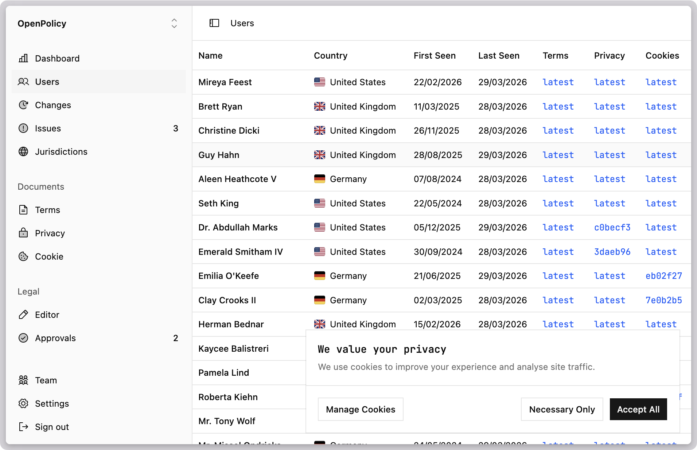
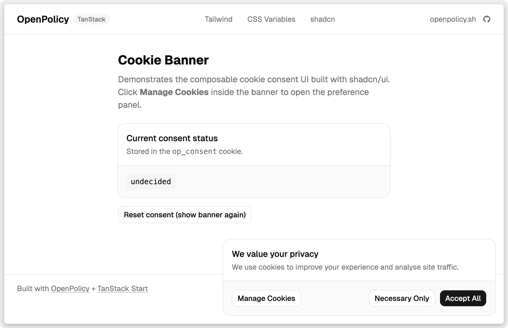

Most cookie banners arrive as a third-party script tag. That means an extra DNS lookup on every page load, a flash of unstyled content while the script boots, a vendor dashboard you have to log into to change the copy, and a component that will never quite match your design system.

`@openpolicy/cookie-banner` is a [shadcn](https://ui.shadcn.com) registry item. The code lands in your repo — not a CDN. It's styled with Tailwind, wired to your OpenPolicy config, and editable like any other component in your project.

## Install

```sh
bunx shadcn@latest add @openpolicy/cookie-banner
```

This drops `CookieBanner` and `CookiePreferences` into `components/ui/openpolicy/` and adds an `@openpolicy/config` starter at `lib/openpolicy.ts` if one isn't already there.

## Add cookies to your config

Open `lib/openpolicy.ts` and add cookie fields — OpenPolicy auto-detects the cookie policy from the presence of `cookies`:

```ts
import { defineConfig, LegalBases } from "@openpolicy/sdk";

export default defineConfig({
  company: { ... },
  effectiveDate: "2026-03-31",
  jurisdictions: ["eu"],
  cookies: {
    used: {
      essential: true,
      analytics: true,
      functional: false,
      marketing: false,
    },
    context: {
      essential: { lawfulBasis: LegalBases.LegalObligation },
      analytics: { lawfulBasis: LegalBases.Consent },
      functional: { lawfulBasis: LegalBases.Consent },
      marketing: { lawfulBasis: LegalBases.Consent },
    },
  },
});
```

The categories you list here (`essential`, `analytics`, etc.) drive both the banner copy and the preferences panel — no separate config file.

## Wire up the provider

Wrap your root layout with `<OpenPolicy>`. The provider reads the cookie config and manages consent state in localStorage:

```tsx
import openpolicy from "@/lib/openpolicy";
import { OpenPolicy } from "@openpolicy/react";

export default function RootLayout({ children }) {
	return <OpenPolicy config={openpolicy}>{children}</OpenPolicy>;
}
```

## Drop in the components

Both components read from `useCookies()` internally — no props needed:

```tsx
import { CookieBanner, CookiePreferences } from "@/components/ui/openpolicy/cookie-banner";

export default function RootLayout({ children }) {
	return (
		<OpenPolicy config={openpolicy}>
			{children}
			<CookieBanner />
			<CookiePreferences />
		</OpenPolicy>
	);
}
```

`CookieBanner` renders a fixed bottom-right card the first time a visitor lands. It has three buttons: **Accept All**, **Necessary Only**, and **Manage Cookies** (which opens the preferences dialog). `CookiePreferences` is a shadcn Dialog with per-category toggles, plus **Save** and **Reject All**.



## Gate content on consent

`ConsentGate` conditionally renders its children based on what the user has consented to:

```tsx
import { ConsentGate } from "@openpolicy/react";

// Only renders if the user has enabled analytics:
<ConsentGate requires="analytics">
  <PlausibleScript />
</ConsentGate>

// Requires both analytics and marketing:
<ConsentGate requires={{ and: ["analytics", "marketing"] }}>
  <SegmentScript />
</ConsentGate>
```

This replaces the scattered `if (consent.analytics)` checks that tend to accumulate in app code.

## Build your own UI

If shadcn isn't part of your project, or you want a fully custom banner, `useCookies()` gives you everything you need:

```tsx
const {
	route, // "cookie" | "preferences" | "closed"
	acceptAll, // () => void
	acceptNecessary, // () => void
	categories, // [{ key, label, enabled, locked }]
	toggle, // (key: string) => void
	save, // () => void
	has, // (expr: string | ConsentExpr) => boolean
} = useCookies();
```

`route` tells you which screen to show. `categories` is derived from your `openpolicy.ts` config — add `functional: true` and it appears automatically. `has` is the same expression evaluator that powers `ConsentGate`.

## Why this is better than a script tag

- **No external requests.** The components live in your repo. No third-party DNS lookup, no CDN dependency, no outage risk.
- **Matches your design.** Edit `cookie-banner.tsx` like any other component — swap Tailwind classes, use your design tokens, change the copy.
- **Config-driven categories.** Cookie categories come from `openpolicy.ts`. Add or remove a category there and it propagates everywhere: the banner, the preferences panel, and `ConsentGate`.
- **Consent gates, not manual checks.** `<ConsentGate requires="analytics">` is clearer and less error-prone than checking a consent object in every script component.
- **Inspectable.** Consent is stored in localStorage under `op_consent`. Open DevTools and you can see exactly what was recorded — no black box.

The same `openpolicy.ts` config powers the `<PrivacyPolicy>` and `<CookiePolicy>` React components too. One file, all your legal docs.

---

If you build something with it, open an issue or share it on social. We'd like to see what you make.
