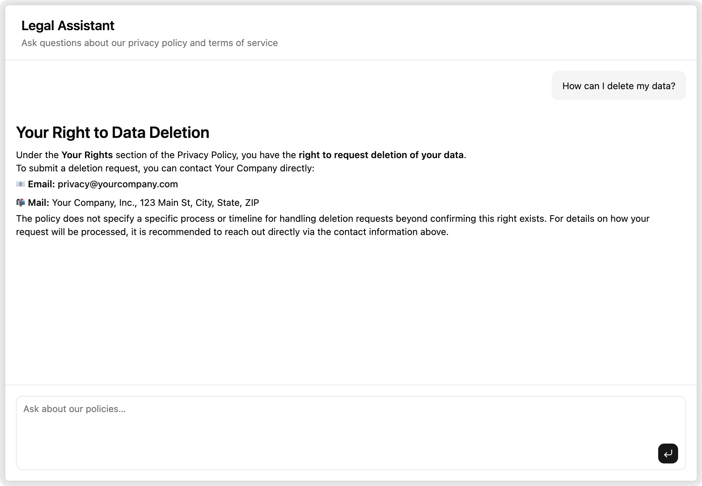

Nobody reads privacy policies. They're long, dense, and written for lawyers — but the information in them matters. Users want to know if you sell their data, how to delete their account, what happens if you shut down. Right now they either wade through legalese or just don't bother.

With a language model and about 30 lines of backend code, you can let them just ask.



Here's how it works: OpenPolicy compiles your policy configuration into Markdown. That Markdown becomes a Claude system prompt. Users type a question, Claude answers it in plain English, citing the relevant section. No RAG, no vector database — the whole policy fits comfortably in context.

You can try the [live demo](https://nextjs.openpolicy.sh) or browse the [full example on GitHub](https://github.com/jamiedavenport/openpolicy/tree/main/examples/nextjs) if you want to jump straight to the code.

## Your policies as data

OpenPolicy starts with a typed configuration object. You declare facts about your company — what data you collect, what rights users have, which jurisdictions you operate in — and OpenPolicy compiles them into correctly worded legal prose:

```ts
// openpolicy.ts
import { defineConfig } from "@openpolicy/sdk";

export default defineConfig({
  company: {
    name: "Your Company",
    legalName: "Your Company, Inc.",
    contact: "privacy@yourcompany.com",
  },
  privacy: {
    dataCollected: { "Personal Information": ["Full name", "Email address"] },
    userRights: ["access", "erasure"],
    jurisdictions: ["us"],
  },
  terms: {
    eligibility: { minimumAge: 13 },
    termination: { companyCanTerminate: true, userCanTerminate: true },
    governingLaw: { jurisdiction: "Delaware, USA" },
  },
});
```

Because it's TypeScript, mistakes get caught at author time — not after you've shipped a policy with missing required fields. That same config is what feeds the chatbot.

## The API route

The entire backend is one file:

```ts
// app/api/chat/route.ts
import { anthropic } from "@ai-sdk/anthropic";
import { compile, expandOpenPolicyConfig } from "@openpolicy/core";
import { renderMarkdown } from "@openpolicy/renderers";
import { convertToModelMessages, streamText, type UIMessage } from "ai";
import openpolicy from "../../../openpolicy";

const inputs = expandOpenPolicyConfig(openpolicy);
const policiesMarkdown = inputs
  .map((input) => renderMarkdown(compile(input)))
  .join("\n\n---\n\n");

const SYSTEM_PROMPT = `You are a legal assistant for ${openpolicy.company.name}. \
Answer questions about the following policies clearly and concisely. \
Cite specific sections when relevant. Do not speculate beyond what the policies state.

${policiesMarkdown}`;

export async function POST(req: Request) {
  const { messages }: { messages: UIMessage[] } = await req.json();
  const result = streamText({
    model: anthropic("claude-sonnet-4-6"),
    system: SYSTEM_PROMPT,
    messages: await convertToModelMessages(messages),
  });
  return result.toUIMessageStreamResponse();
}
```

**Why Markdown instead of HTML?** The renderers support both, but Markdown is the right choice for LLM context. HTML tags burn tokens without adding meaning — Markdown gives Claude the same structural information (headings, lists, emphasis) without the noise.

**Why a system prompt instead of RAG?** Privacy policies and terms of service are short — typically 2,000–5,000 words combined — and meant to be understood as a whole. A user asking about account termination might also need to know about the notice period, what happens to their data, and whether they can appeal, all from different sections. Putting the full documents in context lets Claude surface that complete picture naturally.

**Prompt caching:** The policy content doesn't change between requests. If you're running this at volume, [Anthropic's prompt caching](https://docs.anthropic.com/en/docs/build-with-claude/prompt-caching) means you pay for those tokens once per cache TTL rather than on every call.

## The chat UI

The UI is built with [AI SDK](https://sdk.vercel.ai/docs)'s `useChat` hook and a set of composable [AI Elements](https://github.com/openpolicyai/openpolicy/tree/main/examples/nextjs/components/ai-elements) chat components. Most of it is straightforward — the one non-obvious detail is the `isAnimating` prop:

```tsx
const isLastAssistant = msg.role === "assistant" && i === messages.length - 1;

<MessageResponse isAnimating={isLastAssistant && isStreaming}>
  {text}
</MessageResponse>
```

`isAnimating` enables typewriter-style streaming rendering. The guard matters: without it, every completed message re-animates on each render cycle. You only want animation on the message that's actively streaming.

Starter questions help users get started without staring at a blank input:

```tsx
const STARTERS = [
  "What data do you collect about me?",
  "How can I delete my data?",
  "What are the terms for account termination?",
  "What is the governing law for disputes?",
];
```

`PromptInputSubmit` handles the send/stop toggle automatically when you pass `status` and `onStop` — no extra state needed.

## What you get

Users open the chat, see the starter questions, pick one or type their own, and get a clear answer in seconds. The answer cites the relevant section of the policy — so if they want to verify it, they can go read the actual document.

**Rate limit the route.** It calls the Anthropic API on every request. Something like `@upstash/ratelimit` keyed on client IP is usually enough. The pattern is a middleware check before `streamText`:

```ts
const { success } = await ratelimit.limit(ip);
if (!success) return new Response("Too many requests", { status: 429 });
```

**You still get traditional policy pages too.** The chatbot doesn't replace your `/privacy` and `/terms` routes — it sits alongside them. `<PrivacyPolicy />` and `<TermsOfService />` render the full documents directly into your Next.js app from the same config object. Users who want to read the full text still can; users who just want a quick answer can ask. Both outputs, one source of truth.

Check out the [full example](https://github.com/jamiedavenport/openpolicy/tree/main/examples/nextjs).
