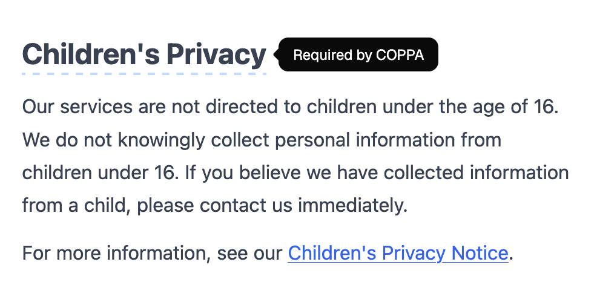

Every SaaS app ships a terms of service. Nobody reads it. The usual approach is a Google Doc pasted into a static page — no context, no explanation, just wall-of-text legalese that users click through on autopilot.

OpenPolicy generates your ToS as a structured document tree, not raw HTML. Each heading and paragraph carries a `context.reason` — a plain-English note explaining why that clause exists. Pair it with shadcn's `Tooltip` and you get a terms page that actually teaches users what they're agreeing to.

## Install

```sh
bun add @openpolicy/sdk @openpolicy/react
# then add shadcn tooltip
bunx shadcn@latest add tooltip
```

## Define your terms

Create an `openpolicy.ts` at the root of your project and fill in the `terms` block:

```ts
// openpolicy.ts
import { defineConfig } from "@openpolicy/sdk";

export default defineConfig({
  company: {
    name: "Acme",
    legalName: "Acme, Inc.",
    address: "123 Main St, San Francisco, CA 94105",
    contact: "legal@acme.com",
  },
  terms: {
    effectiveDate: "2026-03-19",
    acceptance: {
      methods: ["using the service", "creating an account"],
    },
    eligibility: {
      minimumAge: 13,
    },
    accounts: {
      registrationRequired: true,
      userResponsibleForCredentials: true,
      companyCanTerminate: true,
    },
    prohibitedUses: [
      "Violating any applicable laws or regulations",
      "Attempting to gain unauthorized access to any part of the service",
      "Transmitting malware or malicious code",
    ],
    intellectualProperty: {
      companyOwnsService: true,
      usersMayNotCopy: true,
    },
    disclaimers: {
      serviceProvidedAsIs: true,
      noWarranties: true,
    },
    limitationOfLiability: {
      excludesIndirectDamages: true,
      liabilityCap: "the amount paid by the user in the past 12 months",
    },
    governingLaw: {
      jurisdiction: "Delaware, USA",
    },
    changesPolicy: {
      noticeMethod: "email or prominent notice on the website",
      noticePeriodDays: 30,
    },
  },
});
```

## The `context.reason` field

When OpenPolicy compiles your config into a document tree, it attaches plain-English reasoning to every heading it generates. The `HeadingNode` type (from `@openpolicy/core`) looks like this:

```ts
export type NodeContext = {
  reason?: string;
};

export type HeadingNode = {
  type: "heading";
  level?: 1 | 2 | 3 | 4 | 5 | 6;
  value: string;
  context?: NodeContext;
};
```

A heading like "Limitation of Liability" will arrive with `context.reason` set to something like `"This caps our legal exposure under standard US commercial contracts."` — generated from the config you provided, not a static string.

## The custom Heading component

Override the `Heading` renderer to check for `node.context.reason`. If it exists, wrap the heading in a `Tooltip`; if not, render it as plain text:

```tsx
import {
  Tooltip,
  TooltipContent,
  TooltipTrigger,
} from "@/components/ui/tooltip";

const components = {
  Heading: ({
    node,
  }: {
    node: { value: string; context?: { reason?: string } };
  }) => {
    if (node.context?.reason) {
      return (
        <Tooltip>
          <TooltipTrigger className="mb-3">
            <h2 className="text-2xl font-bold border-b-2 border-dashed border-blue-200 hover:border-blue-400">
              {node.value}
            </h2>
          </TooltipTrigger>
          <TooltipContent side="right">{node.context.reason}</TooltipContent>
        </Tooltip>
      );
    }
    return <h2 className="text-2xl font-bold mb-3">{node.value}</h2>;
  },
};
```

The dashed underline signals to the user that a heading is hoverable without being distracting. Casual users scroll past; curious users hover and learn.

## Wire it up in your route

Pass your `components` map to `<TermsOfService />` and wrap the page in `<TooltipProvider>` — required by Radix UI for tooltip context:

```tsx
import { TermsOfService, OpenPolicy } from "@openpolicy/react";
import { TooltipProvider } from "@/components/ui/tooltip";
import openpolicy from "./openpolicy";

export function TermsOfServicePage() {
  return (
    <TooltipProvider>
      <main className="max-w-2xl mx-auto px-6 py-16">
        <OpenPolicy config={openpolicy}>
          <TermsOfService components={components} />
        </OpenPolicy>
      </main>
    </TooltipProvider>
  );
}
```

That's it. Every heading that has a legal rationale attached is now annotated — with zero extra config.

## Why this matters

Terms pages that users understand lead to fewer support tickets asking "what did I agree to?" Tooltips are non-intrusive by design: they don't interrupt reading, they reward curiosity. The policy itself is still valid legalese — the tooltips are additive context, not a replacement.

The same `context.reason` field is available on `DocumentSection`, `ParagraphNode`, and `ListNode` if you want deeper coverage. Override `Section` or `Paragraph` the same way and you can annotate down to individual sentences.

## Why this is better than a static page

- **Interactive but non-intrusive.** Hover to learn, scroll to skip — works for every type of user.
- **Type-safe.** `node.context?.reason` is typed end-to-end. No stringly-typed hacks.
- **Structured.** Annotations come from the compiler, not copy-pasted text. They stay consistent with your config.
- **Extensible.** Override `Section`, `Paragraph`, and `List` the same way — progressive disclosure at every level of the document.
